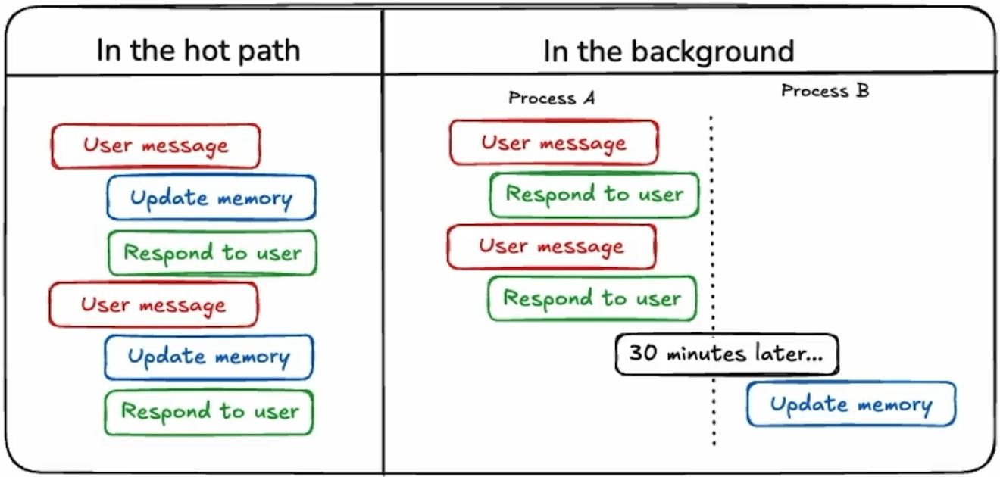

# Long-Term Agentic Memory with LangGraph

### Types of Memory

| Types of Memory   | What is stored    | Agent example         |
|:-----             |:-----:            |-----:                 |
| Semantic          | Facts             | Facts about an user   |
| Episodic          | Experiences       | Past agent actions    |
| Procedural        | Instructions      | Agent system prompt   |

+ Memories can be saved using difference mechanisms: 

    + **In the hot path**: Generally we only have one Agent. Simple to maintaince. The issue is the latency will increase since Agent doing both, update memory and respond to user.
    + **In the background**: Separate save mechanism from Agent core. Responsed to memory faster. The issue is now we have two Agent. The updates might not happen instantaneously. Might only happend when the updating memory gets kicked off.

+ Conclusion from me:
    + [semantic-memory](semantic-memory.ipynb): Acts as the agent's knowledge base. It stores facts, concepts, and general information that the agent can reference when answering questions.
    + [episodic-memory](semantic-and-episodic-memory.ipynb): Remembers specific cases or past interactions. If there are cases we want to avoid handling, they can be stored here. When a user queries one of these cases, the system can recognize it and either stop the process and return the directly return the template response.
    + [procedural-memory](semantic-and-episodic-procedural-memory.ipynb): Guiding agent behavior and response styles through optimized prompts — essentially encoding logic and decision-making directly into the prompt structure.